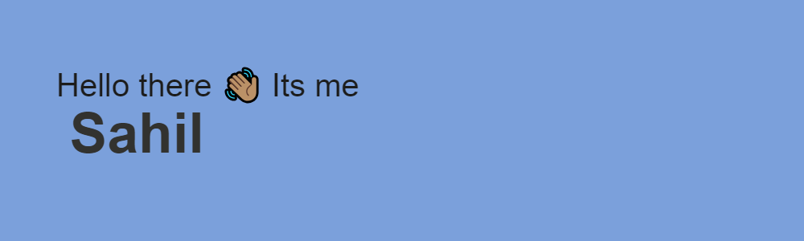

<h3 align="center">A passionate web developer trying to learn something</h3>

  

  

- 🌱 Currently in **my third year of studies.**

- 📫 How to reach me **sahilraja2002@gmail.com**

<h3 align="left">Connect with me:</h3>

<h3 align="left">Languages and Tools:</h3>

      

&nbsp;

